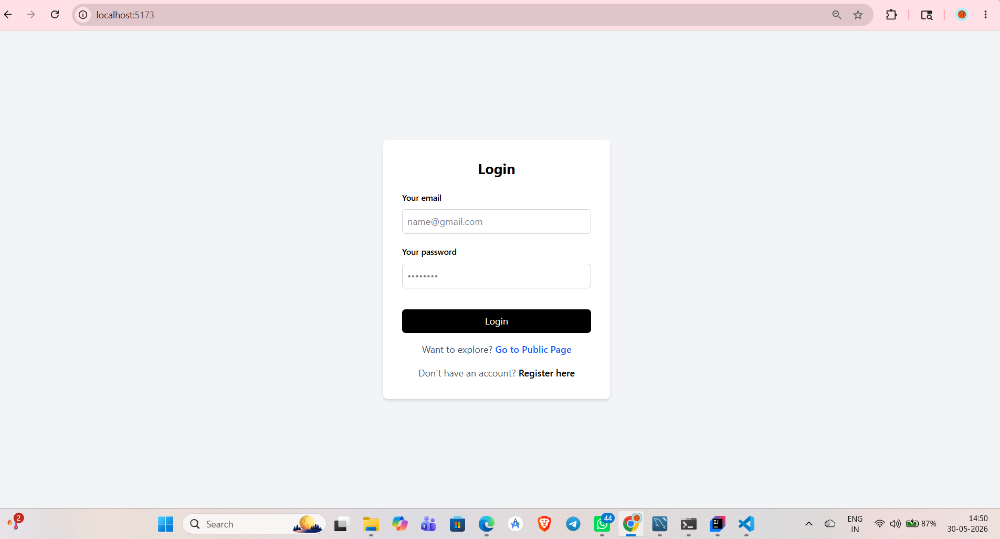
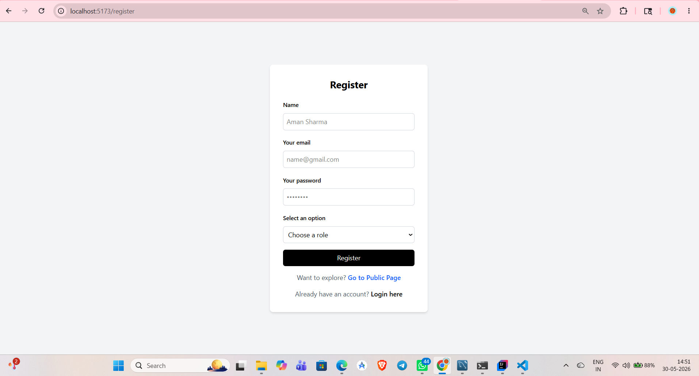
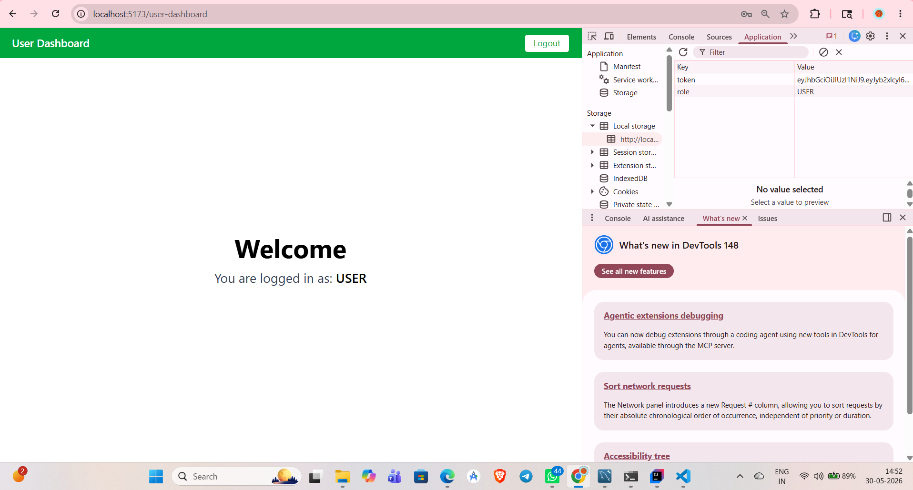
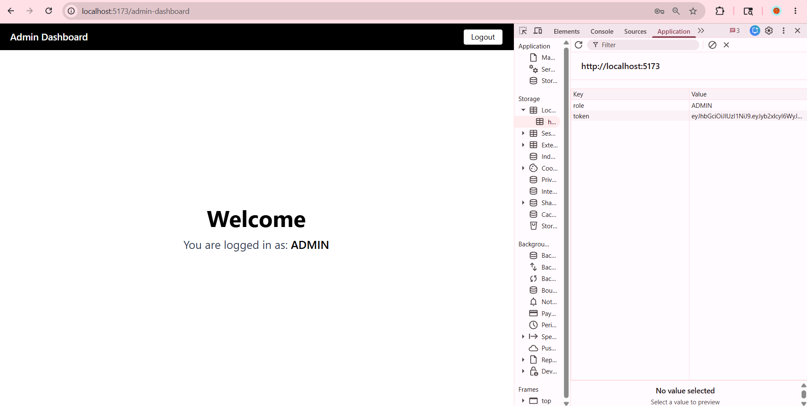
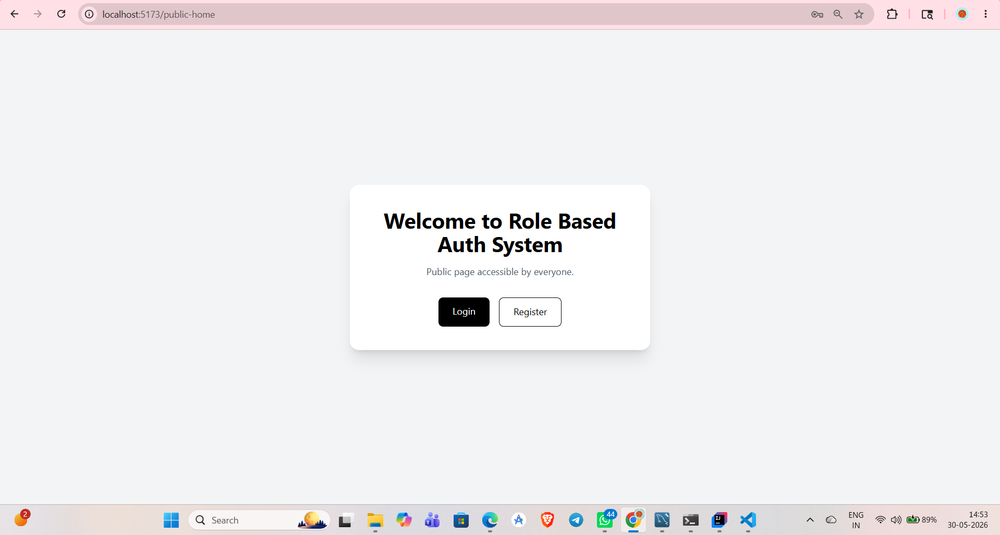

# 🔐 RBAC Authentication System (Full Stack)

## 📌 Project Overview
This is a Full Stack Role-Based Authentication System using Spring Boot (Backend) and React + TypeScript (Frontend).  
It supports JWT authentication and role-based access control (USER / ADMIN).

---

## 🚀 Features

- User Registration (Name, Email, Password, Role)
- User Login with JWT Authentication
- Role-Based Access Control (RBAC)
- Protected Routes (USER / ADMIN)
- Public Page Access
- Secure API endpoints
- Frontend + Backend integration

---

## 🛠️ Tech Stack

### Backend
- Java 17
- Spring Boot
- Spring Security
- JWT Authentication
- Spring Data JPA
- MySQL

### Frontend
- React + TypeScript
- Vite
- Axios
- React Router
- Tailwind CSS

---

## 📂 Project Structure
```
 rbac-assignment/
│
├── auth-rbac-backend/
│ ├── src/
│ │ ├── main/
│ │ │ ├── java/
│ │ │ └── resources/
│ ├── pom.xml
│
├── auth-rbac-fronted/
│ ├── src/
│ │ ├── api/
│ │ ├── pages/
│ │ ├── routes/
│ │ ├── utils/
│ │ └── App.tsx
│ ├── package.json
│ ├── vite.config.ts
│
├── screenshots/
└── README.md
```
## 📸 Screenshots

### 🔐 Login Page


👉 User enters email and password. After successful login, JWT token is generated and role is stored in localStorage.

---

### 📝 Register Page


👉 New user can register by entering name, email, password, and selecting role (USER / ADMIN).

---

### 👤 User Dashboard


👉 This page is accessible only to USER role. It shows user-specific content after login.

👉 After login, JWT token and user role are stored in localStorage and used for authentication and role-based access control.

---

### 🛡️ Admin Dashboard


👉 This page is restricted to ADMIN users only. It shows admin-level features and controls.

👉 After login, JWT token and user role are stored in localStorage and used for authentication and role-based access control.

---

### 🌍 Public Page


👉 This page is accessible to everyone without login.


---